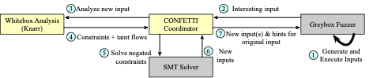

# CONFETTI: CONcolic Fuzzer Employing Taint Tracking Information

CONFETTI is a fuzzer that hybridizes the coverage-guided fuzzing guidance algorithm, [Zest](https://arxiv.org/abs/1812.00078), with customized mutators based on dynamic taint tracking and concolic execution information. 

## Overview
Fuzz testing (fuzzing) allows developers to detect bugs and vulnerabilities in code by automatically generating defect-revealing inputs.
Most fuzzers operate by generating inputs for applications and mutating the bytes of those inputs, guiding the fuzzing process with branch coverage feedback via instrumentation.
Whitebox guidance (e.g., taint tracking or concolic execution) is sometimes integrated with coverage-guided fuzzing to help  cover tricky-to-reach branches that are guarded by complex conditions (so-called "magic values").
This integration typically takes the form of a targeted input mutation, for example placing particular byte values at a specific offset of some input in order to cover a branch.
However, these dynamic analysis techniques are not perfect in practice, which can result in the loss of important relationships between input bytes and branch predicates, thus reducing the effective power of the technique.

CONFETTI introduces a new, surprisingly simple, but effective technique, *global hinting*, which allows the fuzzer to insert these interesting bytes not only at a targeted position, but in any position of any input.
We implemented this idea in Java, creating CONFETTI, which uses both targeted and global hints for fuzzing.
In an empirical comparison with two baseline approaches, a state-of-the-art greybox Java fuzzer and a version of CONFETTI without global hinting, we found that CONFETTI covers more branches and finds 15 previously unreported bugs, including 9 that neither baseline could find.

CONFETTI is a research prototype, but nonetheless, we have had success applying it to fuzz the open-source projects Apache Ant, BCEL and Maven, Google's  Closure Compiler, and Mozilla's Rhino engine.

You can read more about CONFETTI's design and evaluation in our [ICSE 2022 paper](https://jonbell.net/publications/confetti).

## Architecture
CONFETTI consists of three key components that run in coordination: 1) the parametric fuzzer, which is responsible for input generation and execution of the target program, 2) the whitebox analysis process, which is responsible for performing dynamic taint tracking and constraint collection on interesting inputs, and  3) the CONFETTI coordinator process, which transmits inputs between the fuzzer and the analyzer and interacts with a constraint solver.



## Building
CONFETTI is currently only compatible with Java 8. To build CONFETTI, be sure that you are using a Java 8 JDK, and then, in the root directory of this repository, simply invoke `mvn install`.

All of CONFETTI's dependencies are managed using Maven - there are no additional dependencies that you will need to install to compile CONFETTI. For development purposes, it might be useful to also take a look at the following external libraries that are tightly-integrated with CONFETTI:
* [gmu-swe/knarr](https://github.com/gmu-swe/knarr) - Concolic tracing engine, executes the system under test with an input and records the path constraints on each input
* [gmu-swe/phosphor](https://github.com/gmu-swe/phosphor) - Dynamic taint tracking runtime for Java. Knarr is built on top of Phosphor. 
* [gmu-swe/green-solver](https://github.com/gmu-swe/green-solver) - SMT library interface for Java. This is our fork of [GreenSolver/green](https://github.com/GreenSolver/green), to which we have added additional Z3 support
* [rohanpadhye/JQF](https://github.com/rohanpadhye/JQF) - We use the JQF fuzzing platform to implement CONFETTI; this repository is a fork of JQF, diverging after `e7f667bcb22c455f8c06a8f67b0ca0f9afd8a211`.

## Running
CONFETTI runs on MacOS X and Linux, using Java 8. Please be sure that your `JAVA_HOME` environment variable is set, and pointing to a Java 8 JVM. 
CONFETTI requires at least 16GB of RAM.
We expect that it will be possible to use CONFETTI on Windows (particularly using WSL), but have not tested this configuration.

CONFETTI can be invoked in almost the same way [as JQF](https://github.com/rohanpadhye/JQF/wiki/Writing-a-JQF-test). To run CONFETTI using one of the example programs, use the `bin/confetti` script. For example, to run the Closure compiler test, run the command:

```
./bin/confetti -c $(scripts/examples_classpath.sh) edu.berkeley.cs.jqf.examples.closure.CompilerTest testWithGenerator fuzz-results
```

The default behavior is for the fuzzer to run until you terminate it. To run CONFETTI using a timeout, pass the `-Dtime=duration` property to CONFETTI, which is most easily passed using the environmental variable `JVM_OPTS`  (example: `export JVM_OPTS='-Dtime=24h'`).

## Contact 
Please feel free to [open an issue on GitHub](https://github.com/neu-se/CONFETTI/issues) if you run into any issues with CONFETTI. For other matters, please direct your emails to [Jonathan Bell](mailto:jon@jonbell.net).

## License
CONFETTI is released under the BSD 2-clause license.

## Acknowledgements
CONFETTI builds atop [JQF](https://github.com/rohanpadhye/JQF), which is distributed under the BSD 2-clause license.
